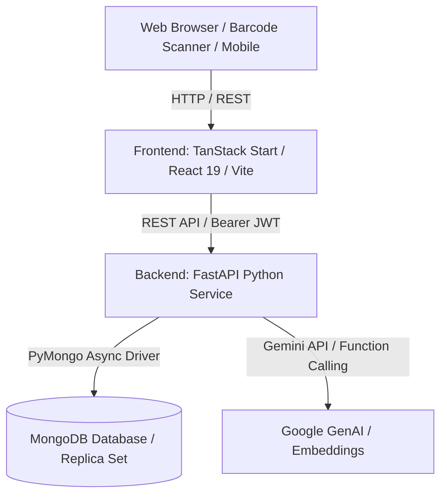

# Whitfield Warehouse Management System (WMS)

A robust, enterprise-grade, multi-warehouse fulfillment and inventory management platform featuring live inventory control, atomic multi-item order reservation, barcode scanning, role-based access control (RBAC), an operational RAG Knowledge Center, and Voice AI operator assistance.

---

## 🏗️ Architecture Overview

The WMS follows a modern, decoupled architecture:



- **Frontend (`frontend/`)**: TanStack Start + React 19 + Vite 8 with automatic SSR/SPA routing.
- **Backend (`backend/`)**: FastAPI + Python async runtime with multi-document transactions and RBAC.
- **Database**: MongoDB (local instance or replica set) providing ACID multi-document transactions and atomic conditional updates.
- **AI & RAG**: Google Gemini (`gemini-2.5-flash` and `gemini-embedding-exp-03-07`) with deterministic fallback when AI keys are unconfigured.

---

## 💻 Local Development Setup

### Prerequisites
- Node.js 20+ and npm (or Bun / pnpm)
- Python 3.11+
- MongoDB 6.0+ (running locally on port 27017 or replica set on 27018)

### 1. Backend Setup

```bash
cd backend

# Create and activate Python virtual environment
python -m venv venv
# On Windows (PowerShell):
.\venv\Scripts\Activate.ps1
# On macOS/Linux:
# source venv/bin/activate

# Install dependencies
pip install -r requirements.txt

# Configure environment variables
cp .env.example .env

# Run FastAPI backend with hot-reload
uvicorn main:app --reload --host 127.0.0.1 --port 8000
```
Backend will be available at: `http://127.0.0.1:8000`  
API Swagger Docs: `http://127.0.0.1:8000/docs`  
Health check: `http://127.0.0.1:8000/health`

### 2. Frontend Setup

```bash
cd frontend

# Install dependencies
npm install

# Configure environment variables
cp .env.example .env

# Start development server
npm run dev
```
Frontend will be available at: `http://localhost:5173` (or configured dev port).

---

## ⚙️ Environment Variables Reference

### Frontend (`frontend/.env`)

| Variable | Required | Description | Default / Example |
| :--- | :---: | :--- | :--- |
| `VITE_API_BASE_URL` | **Yes** | Base URL of the FastAPI backend service (no trailing slash). | `http://127.0.0.1:8000` |

### Backend (`backend/.env`)

| Variable | Required | Description | Default / Example |
| :--- | :---: | :--- | :--- |
| `MONGODB_URL` | **Yes** | MongoDB connection string. | `mongodb://127.0.0.1:27017` |
| `DATABASE_NAME` | **Yes** | Target database name. | `whitfield_wms` |
| `JWT_SECRET` | **Yes** | Secret key for signing and verifying JWT authentication tokens. | Secure 64-char random hex string |
| `JWT_ALGORITHM` | No | Cryptographic algorithm for JWT. | `HS256` |
| `ACCESS_TOKEN_EXPIRE_MINUTES` | No | Token lifetime in minutes. | `480` (8 hours) |
| `ADMIN_EMAIL` | Optional | Email for initial admin user seed. | `admin@whitfield.com` |
| `ADMIN_PASSWORD` | Optional | Initial password for admin seed. | `StrongPassword123!` |
| `GEMINI_API_KEY` | Optional | Google Gemini API key for live AI assistant & RAG embeddings. | Obtained from Google AI Studio |
| `KNOWLEDGE_PDF_PATH` | Optional | Custom filesystem path to WMS Operations Handbook PDF. | `core/database/knowledge/wms_operations_and_knowledge_handbook.pdf` |

---

## 🧪 Build & Test Verification

All automated tests and linters pass without regressions:

```bash
# Frontend Validation (51+ tests)
cd frontend
npm run lint         # 0 errors
npx tsc --noEmit     # 0 type errors
npx vitest run       # 51 passed
npm run build        # Production bundle verified

# Backend Validation (118+ tests)
cd backend
python -m pytest     # 118 passed
```

---

## ✅ Local Verification Checklist

After completing local setup, verify the following core workflows:

- [ ] 1. Open local frontend in browser (`http://localhost:5173`).
- [ ] 2. Login with valid credentials (`/login`).
- [ ] 3. Verify `/auth/me` resolves and user session initializes.
- [ ] 4. Dashboard loads summary metrics (inventory count, active orders, warehouses).
- [ ] 5. Warehouse selector toggles between `RENO` and `COLUMBUS`.
- [ ] 6. Products catalog loads with SKU, category, and price data (`/products`).
- [ ] 7. Sellers view loads active vendor and supplier listings (`/sellers`).
- [ ] 8. Inventory table displays stock levels, reservations, and damaged units (`/inventory`).
- [ ] 9. Receiving module displays inbound records (`/receiving`).
- [ ] 10. Orders module displays order list, customer info, and line items (`/orders`).
- [ ] 11. Fulfillment module displays pick/pack/ship workflows (`/fulfillment`).
- [ ] 12. Barcode scanner interface opens and camera/manual input responds (`/scanner`).
- [ ] 13. Audit trail records log operational movements and changes (`/audit`).
- [ ] 14. Users view displays user list and role management for `ADMIN` role (`/users`).
- [ ] 15. Knowledge Center interface opens (`/knowledge`).
- [ ] 16. RAG handbook search endpoint responds with citations or procedural fallback.
- [ ] 17. Voice AI modal opens with browser microphone permission prompt.
- [ ] 18. Voice command dispatches to `/v1/voice/command` and executes intent.
- [ ] 19. RBAC permission barriers properly restrict unauthorized routes/actions.
- [ ] 20. User logout clears tokens and redirects securely to `/login`.

---

## 📄 License & Compliance

Proprietary Warehouse Management System — Whitfield Fulfillment. All rights reserved.
